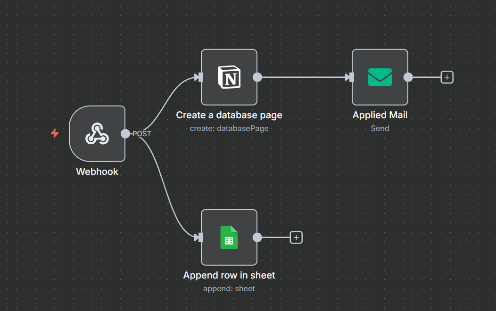
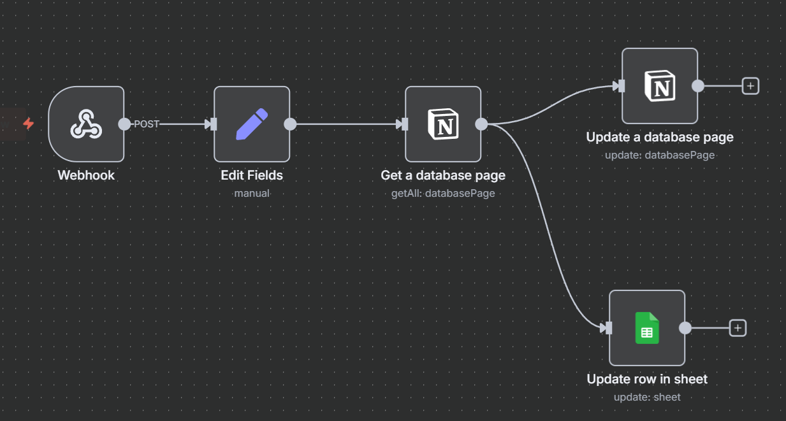

# 🚀 Buildables Process Automation Platform
## Enterprise-Grade n8n Workflow Orchestration & Multi-System Integration



---

### 📋 **Project Overview**

A comprehensive process automation platform built with **n8n** that orchestrates end-to-end organizational workflows across 6 distinct pathways. This system handles complete applicant lifecycles from initial submission through final decision-making, featuring automated notifications, multi-system data synchronization, and real-time status tracking.

### 🎯 **Key Features**

- **🔄 Multi-Pathway Orchestration**: 6 distinct program flows (Fellowship, Core Team, Partnership, Track Leadership, Slack Community, Support-Us)
- **📊 Cross-System Integration**: Seamless sync between Notion, Google Sheets, and external forms
- **📧 Automated Communications**: Multi-channel messaging via SMTP, Slack API, and status notifications
- **🛡️ Data Integrity**: Idempotency controls and state management preventing duplicate processing
- **📈 Scalable Decision Engine**: 15+ status transitions with conditional branching logic
- **⚡ Real-time Monitoring**: Performance tracking with warning/kickout automation

---

### 🏗️ **Architecture Overview**

```
┌─────────────────┐    ┌─────────────────┐    ┌─────────────────┐
│   Web Forms     │    │   n8n Workflows │    │   Notion CRM    │
│   Submissions   │───▶│   Orchestrator  │───▶│   Databases     │
└─────────────────┘    └─────────────────┘    └─────────────────┘
                               │
                               ▼
┌─────────────────┐    ┌─────────────────┐    ┌─────────────────┐
│  Slack Channels │◀───│   Integration   │───▶│ Google Sheets   │
│  Notifications  │    │      Hub        │    │   Analytics     │
└─────────────────┘    └─────────────────┘    └─────────────────┘
```



---

### 📁 **Workflow Structure**

| **Program** | **Workflows** | **Description** |
|-------------|---------------|-----------------|
| 🎓 **Fellowship** | `1st-phase.json`, `2nd-Phase.json`, `Decision.json` | Cohort-based learning program with multi-phase evaluation |
| 👥 **Core Team** | `CT-Form Submission.json`, `CT-Decision.json` | Internal team member recruitment and onboarding |
| 🤝 **Partnership** | `PS-Form Submission.json`, `PS-Decision.json` | Strategic collaboration intake and approval process |
| 🎯 **Track Leads** | `TL-Form Submission.json`, `TL-Decision.json` | Leadership role assignments with specialized criteria |
| 💬 **Slack Community** | `Form-Submission.json`, `Decision.json` | Community access management and invitation system |
| 💝 **Support-Us** | `SU-Form Submission.json` | Contribution intake (Technology, Financial, Volunteer) |
| ⚠️ **Kickout System** | `Warn_Kick.json` | Performance monitoring with warning/removal automation |

---

### 🔧 **Technical Implementation**

#### **Core Technologies**
- **n8n**: Workflow automation and orchestration
- **Notion API**: CRM database management
- **Google Sheets API**: Data analytics and reporting
- **SMTP Integration**: Automated email communications
- **Slack API**: Team notifications and updates
- **Webhook Processing**: Real-time form submissions

#### **Key Automations**

**1. Intake Processing**
```
Webhook Trigger → Data Validation → Multi-System Write → Email Confirmation
```

**2. Decision Engine**
```
Schedule Trigger → Status Check → Conditional Branching → Notifications → State Update
```

**3. Lifecycle Management**
```
Performance Monitor → Warning System → Escalation Path → Final Actions
```

---

### 📊 **Process Flows**

#### **Standard Evaluative Flow**
```
Submission → Review → Shortlisted → 2nd Phase → Decision → Onboarding/Rejection
```

#### **Partnership Flow**
```
Application → Evaluation → Approved/Not-Approved → Agreement & Integration
```

#### **Community Access**
```
Request → Validation → Approval → Invitation → Access Granted
```

---

### 🎛️ **Advanced Features**

- **Idempotency Controls**: Checkbox-based state management preventing reprocessing
- **Batch Processing**: Efficient handling of multiple records with rate limiting
- **Email Template Engine**: Dynamic content generation for different scenarios
- **Status Taxonomy**: Comprehensive state management across all pathways
- **Cross-System Identity Resolution**: Email-based matching across platforms
- **Audit Trail**: Complete applicant journey tracking with timestamps

---

### 📈 **Business Impact**

- ✅ **100+ monthly applicants** processed automatically
- ✅ **Zero manual status tracking** across all programs
- ✅ **Real-time synchronization** between 3+ systems
- ✅ **Complete audit trail** for all decisions
- ✅ **Scalable framework** supporting concurrent programs

---

### 🛠️ **Setup & Configuration**

#### **Required Credentials**
- Notion API token with database access
- Google Sheets OAuth2 credentials
- SMTP server configuration
- Slack Bot token with channel permissions

#### **Environment Setup**
```bash
# Install n8n
npm install -g n8n

# Import workflows
n8n import:workflow --file="./[workflow-name].json"

# Configure credentials in n8n UI
# Set up webhook endpoints
# Test automation flows
```

---

### 📚 **Documentation**

- **[Process Framework](Process-Framework.md)**: Comprehensive organizational guidelines
- **Individual README files**: Detailed documentation for each program workflow
- **Status Taxonomy**: Standardized state definitions across all pathways
- **API Integration Guides**: Setup instructions for external systems

---

### 🔍 **Monitoring & Observability**

- **Slack Notifications**: Real-time updates to operations team
- **Status Dashboards**: Visual tracking in Notion and Google Sheets
- **Error Handling**: Comprehensive exception management with alerts
- **Performance Metrics**: Automated tracking of processing times and success rates

---

### 🚀 **Scalability & Future Enhancements**

- **Modular Design**: Easy addition of new programs and workflows
- **API-First Architecture**: Integration-ready for additional systems
- **Template Framework**: Reusable components for rapid deployment
- **Analytics Integration**: Ready for advanced reporting and insights

---

### 👨‍💻 **About This Project**

This project demonstrates advanced n8n workflow design, multi-system integration expertise, and enterprise-level process automation. Built to handle complex organizational workflows with reliability, scalability, and maintainability at its core.

**Technologies Used**: n8n, Node.js, Notion API, Google Sheets API, SMTP, Slack API, Webhook Processing, JSON Transformation, Conditional Logic, Batch Processing

---
